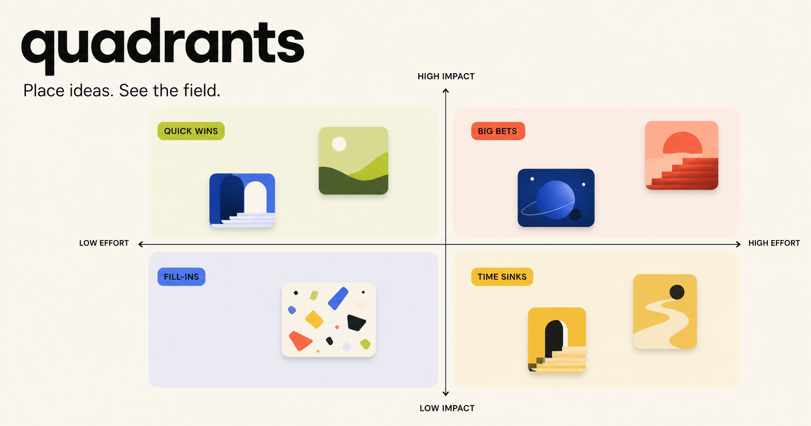
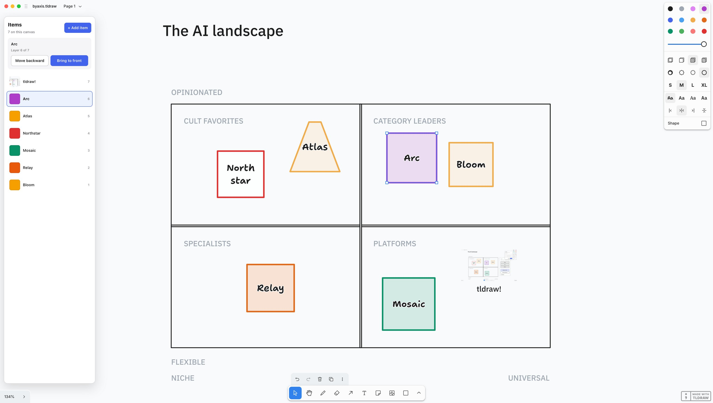

# Byaxis



Byaxis is a private, browser-only tool for making visual quadrant maps. Place color or image-backed items on a two-axis field, tune their overlap order, choose a font treatment, and export a PNG.

There is no account, backend, upload service, or server-side storage. Your map and any images you add stay in your browser's IndexedDB.

## What it does

- Build a map with editable title, axis, and quadrant labels.
- Add named items using a 20-color palette or a dropped image.
- Drag, resize, select, and reorder items from back to front.
- Switch between four bundled Google Font pairings.
- Persist work locally and export a polished PNG.
- Work completely client-side after the app has loaded.

## Run it locally

Requires Node.js 22.13 or newer.

```bash
npm install
npm run dev
```

Open the local URL printed by the dev server.

## Verify it

```bash
npm run lint
npm test
```

`npm test` builds the production worker, verifies the rendered product shell and its browser-only guarantees, then exercises the pure item-layer logic.

## Project map

- `app/page.tsx` — the editor, IndexedDB persistence, and PNG export.
- `app/layout.tsx` — metadata and local Google Font packages.
- `lib/layers.js` — deterministic item layer normalization and reordering.
- `tests/` — rendered-app and layer-behavior tests.
- `BLUEPRINT.md` — a copyable prompt for building and adapting a similar tool.
- `tldraw/byaxis.tldraw` — an experimental self-contained edition for tldraw Offline.

## tldraw Offline edition



The repository includes an early, working [tldraw Offline edition](tldraw/README.md). Open `tldraw/byaxis.tldraw` in the free tldraw Offline desktop app to explore an editable quadrant board with a fixed local sidebar for adding named image items, selecting anything on the canvas, and changing layer order.

The interaction code is stored inside the `.tldraw` document and runs locally. As with any scriptable document, inspect or trust the source before opening copies from people you do not trust.

## Privacy model

Images are read into browser memory as data URLs and saved only in that browser's IndexedDB. Byaxis does not use API routes, forms, analytics, remote uploads, or a database. The Google fonts are bundled at build time by Next.js, so the application does not need to call Google Fonts at runtime.

Clearing site data in your browser clears your saved map. Exported PNGs are created locally with the Canvas API.

## Deployment

This project builds as a Vinext app with a Cloudflare Worker entry point, but it has no runtime bindings or data services. Any host that supports the resulting Worker bundle can serve it. The included `.openai/hosting.json` is deliberately generic: configure a hosting project locally rather than committing a project ID.

## Make your own

Want the same privacy-first editing model with your own visual language? Start with [BLUEPRINT.md](BLUEPRINT.md), paste it into a coding agent, and replace the bracketed choices before building.

## License

[MIT](LICENSE)
